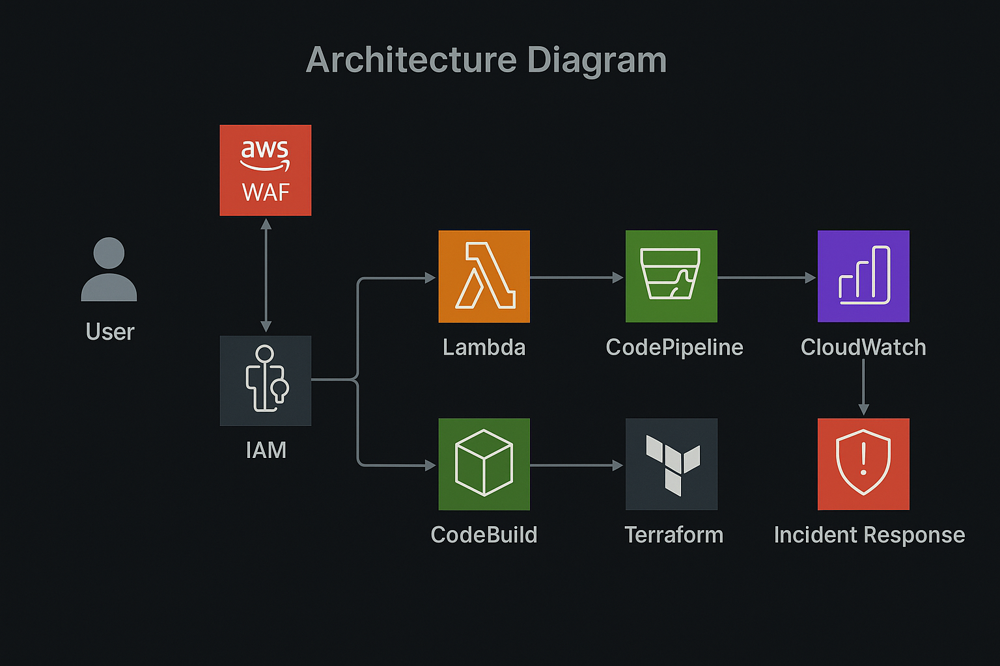

# SecureServerlessApp

# **SecureServerlessApp**

## **Project Overview**

SecureServerlessApp is a **robust, secure, and scalable serverless web application** that demonstrates best practices in AWS architecture, security, and CI/CD automation. This project is fully automated with an integrated CI/CD pipeline, utilizing AWS services like Lambda, API Gateway, and CodePipeline, alongside infrastructure automation using **Terraform**.

The application is designed to be **scalable and secure**, following the principles of the AWS Solutions Architect and CompTIA Security+ certifications. It incorporates fine-grained **IAM policies**, **secure handling of secrets**, and **environment variables**, along with **logging and monitoring** via AWS CloudWatch.

## **Key Features**

- **Serverless Backend with AWS Lambda**: Scalable, event-driven compute platform.
- **Secure API with Amazon API Gateway**: RESTful APIs secured by API Gateway authorizers.
- **Automated CI/CD Pipeline**: Continuous integration and deployment triggered by changes in source code using AWS CodePipeline and CodeBuild.
- **Infrastructure as Code (IaC) with Terraform**: Automates infrastructure provisioning and deployment for the entire application.
- **Fine-grained IAM Role Policies**: Implements least privilege security principles.
- **Environment-specific Configuration & Secret Management**: Secure handling of environment variables and secrets.
- **Logging and Monitoring with AWS CloudWatch**: Tracks application behavior, health, and security.

## **Technologies Used**

### **AWS Services**

- **AWS Lambda**: Event-driven compute service to host backend functions.
- **Amazon API Gateway**: Managed API service to handle requests and secure them with API Gateway authorizers.
- **AWS CodePipeline**: Automates the CI/CD pipeline for the project, integrating various stages of build, test, and deployment.
- **AWS CodeBuild**: Automates the build process as part of the CI/CD pipeline.
- **AWS IAM**: Manages secure access and roles for the application.
- **AWS CloudWatch**: Provides monitoring, logging, and alarms to track application performance and security.
- **Terraform**: Infrastructure automation tool that provisions AWS resources using configuration files.

### **Other Technologies**

- **Terraform**: Infrastructure as Code tool that provisions and manages AWS resources.

## **Architecture Diagram**



The architecture consists of:

- **AWS Lambda** functions handling the serverless backend.
- **API Gateway** for exposing the Lambda functions as RESTful APIs.
- **CodePipeline** for continuous integration and delivery.
- **CodeBuild** for building the application.
- **IAM roles** for controlling access.
- **Terraform** for managing and provisioning all AWS resources.

## **Setup Instructions**

### **Prerequisites**

1. **AWS Account**: Set up your AWS account and configure AWS CLI if needed.
2. **Terraform**: Install [Terraform](https://www.terraform.io/) for provisioning and managing AWS resources.
3. **Git**: Ensure Git is installed to clone this repository.

### **Steps to Deploy**

1. **Clone the Repository:**

   ```bash
   git clone https://github.com/DevWithDarius/SecureServerlessApp.git
   cd SecureServerlessApp
   ```

2. **Set up AWS Credentials:**
   If you haven't already configured AWS CLI with your credentials, run:

   ```bash
   aws configure
   ```

   Follow the prompts to enter your AWS access key, secret key, region, and output format.

3. **Install Terraform:**

   - Download and install Terraform for your operating system from [Terraform downloads](https://www.terraform.io/downloads.html).
   - After installation, verify by running:

   ```bash
   terraform --version
   ```

4. **Provision Infrastructure with Terraform:**

   - Navigate to the Terraform configuration folder:

   ```bash
   cd terraform
   ```

   - Initialize Terraform:

   ```bash
   terraform init
   ```

   - Review the infrastructure plan:

   ```bash
   terraform plan
   ```

   - Apply the Terraform configuration to provision AWS resources:

   ```bash
   terraform apply
   ```

   - Confirm the action by typing `yes` when prompted.

5. **Configure API Gateway and Lambda:**

   - Once Terraform provisions the infrastructure, deploy the backend API by uploading the Lambda function code to AWS.
   - Verify that the Lambda function is accessible via the API Gateway endpoint.

6. **Set up Continuous Integration and Delivery:**

   - Ensure that AWS CodePipeline is set up correctly to trigger deployments when changes are pushed to the GitHub repository.
   - Modify the `buildspec.yml` file if necessary to match your project structure.

7. **Secure Environment Variables and Secrets:**

   - Use AWS Secrets Manager or SSM Parameter Store for storing environment variables and sensitive secrets securely.

8. **Access the Application:**
   - After deployment, your web app will be accessible through the API Gateway URL or a custom domain configured with Route 53.

### **Optional Enhancements**

- **Autoscaling:** Configure Lambda to handle increased traffic.
- **Database Integration:** Set up an RDS (Relational Database Service) to manage dynamic data.
- **Monitoring:** Configure CloudWatch Alarms for Lambda functions to monitor performance.

## **Deployment**

1. Clone this repository:

   ```bash
   git clone https://github.com/DevWithDarius/SecureServerlessApp.git
   ```

2. Follow the setup instructions to deploy the infrastructure and application using Terraform.

3. Once the deployment is complete, access your web application through the custom domain (if configured) or the API Gateway URL.

## **Contributing**

If you'd like to contribute, feel free to fork the repository and submit a pull request. You can contribute by:

- Adding features.
- Fixing bugs.
- Improving documentation.

## **License**

This project is licensed under the MIT License - see the LICENSE file for details.

## **Contact**

- GitHub: [DevWithDarius](https://github.com/DevWithDarius)
- Email: darius@example.com
- Website: [DevWithDarius.us](https://DevWithDarius.us)
